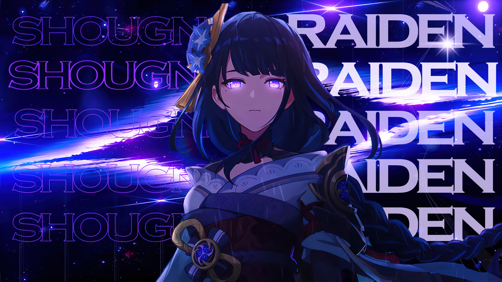

<!-- Header Banner -->
<div align="center">
  
</div>

<!-- Animated Typing -->
<div align="center">
  <a href="https://git.io/typing-svg">
    
  </a>
</div>

<br>

<!-- Profile Views & Followers -->
<div align="center">
  <a href="https://github.com/AlokaWarnakula"></a>
  <a href="https://github.com/AlokaWarnakula?tab=followers"></a>
  <a href="https://github.com/AlokaWarnakula?tab=repositories"></a>
</div>

<br>

<!-- About Me Section -->
## ⚡ About Me

<table>
<tr>
<td width="65%">

- 🎓 **BSc (Hons) in Information Technology** — Specializing in **Artificial Intelligence** @ **SLIIT**
- 🚀 **Founder of KageLoom** — I like to create things that have freedom within
- 🤖 Passionate about **AI, Machine Learning & Deep Learning**
- 🧠 Love solving complex problems & building smart solutions
- 🔐 Fun fact: I create encryption challenges for fun — try mine below!

</td>
<td width="35%" align="center">
  
</td>
</tr>
</table>

---

## 🤖 AI / ML

<p align="center">
  
  
  
  
  
  
  
  
</p>

## 🌐 Frontend

<p align="center">
  
  
  
  
  
  
</p>

## ⚙️ Backend

<p align="center">
  
  
  
  
  
  
  
</p>

## 🗄️ Database & Tools

<p align="center">
  
  
  
  
  
  
  
</p>

---

## 🔥 GitHub Stats

<div align="center">
  
  
</div>

<div align="center">
  
</div>

<div align="center">
  
</div>

---

## 🚀 Top Contributions

<div align="center">
  
</div>

---

## 🔐 Can You Crack This?

<div align="center">
  
  
</div>

<br>

> I created this encryption challenge while learning Python. **If you can crack it, send me a message — let's be friends!** 🤝

<details>
<summary>🔐 <b>Click to reveal the Encrypted Code</b></summary>
<br>

```
173132132145150210212148201197146200132200216165132168197132162150132214218205201197210202201201165208146148214215132132214176132173132218174209132205132132221201197152210214171197187165177197210208208132173212201148205210201153132132132132150132214197205169208179216209183201174165145202201132197176
```

</details>

<details>
<summary>🔑 <b>Click to reveal the Decryption Key</b></summary>
<br>

```
42-82-68-86-92-32-18-95-79-69-94-33-76-53-37-60-66-77-8-44-88-90-71-78-73-27-40-46-43-84-22-20-14-29-97-98-28-23-6-41-75-62-25-0-13-57-16-70-15-3-61-1-12-65-17-96-49-10-26-80-2-31-7-19-21-39-5-30-67-47-74-91-63-52-36-93-34-50-85-54-99-89-9-11-56-72-4-83-38-81-35-24-45-51-87-64-58-59-48-55
```

</details>

---

## 📬 Let's Connect

<div align="center">
  <a href="https://www.linkedin.com/in/aloka-warnakula-550255358/" target="_blank">
    
  </a>
  <a href="https://web.facebook.com/profile.php?id=100088103778641" target="_blank">
    
  </a>
  <a href="https://www.instagram.com/aloka_warnakula/?hl=en" target="_blank">
    
  </a>
  <a href="mailto:alokawarnakula77@gmail.com">
    
  </a>
</div>

<br>

<div align="center">
  
</div>

<br>

<div align="center">
  <picture>
    <source media="(prefers-color-scheme: dark)" srcset="https://raw.githubusercontent.com/platane/snk/output/github-contribution-grid-snake-dark.svg" />
    <source media="(prefers-color-scheme: light)" srcset="https://raw.githubusercontent.com/platane/snk/output/github-contribution-grid-snake.svg" />
    
  </picture>
</div>

<!-- Footer -->

